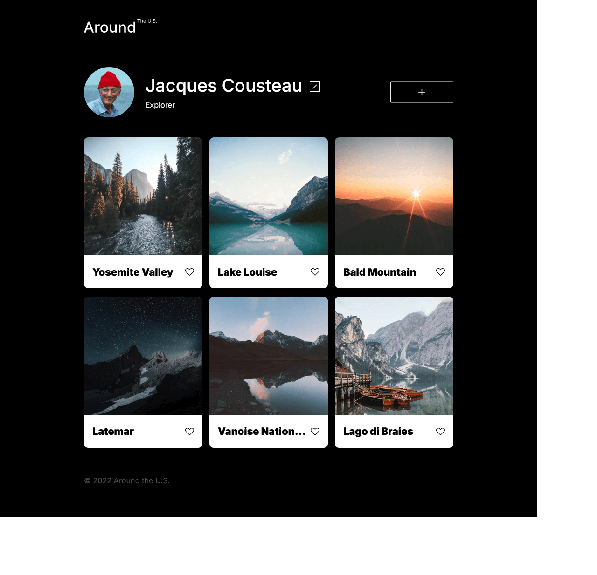
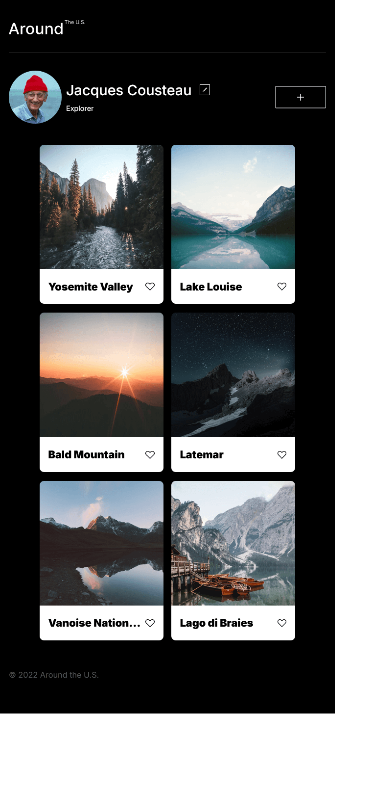
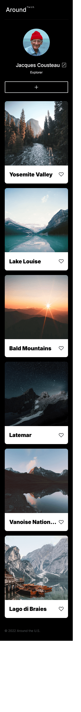

# Project 3: Around The U.S.

### Overview

- Intro
- Figma
- Images

**Intro**

This Around the U.S. webpage is the third project in the Software Engineering program at TripleTen. The project uses HTML and CSS to create a responsive design so all the elements are displayed correctly on popular screen sizes for desktop, tablet, and mobile devices based on a Figma design.

## Project features

- Semantic HTML
- Flexbox
- Grid layout
- Positioning
- Flat BEM file structure

  **Figma**

- [Link to the project on Figma](https://www.figma.com/file/ii4xxsJ0ghevUOcssTlHZv/Sprint-3%3A-Around-the-US?node-id=0%3A1)

**Images**

**Video**

