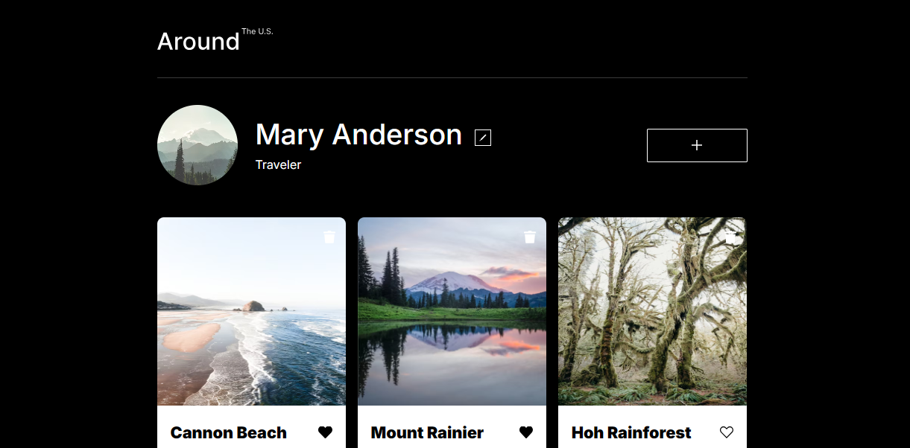

# Around The U.S.

[Link to Project](https://maryeande.github.io/se_project_aroundtheus/)

### Overview

- Intro
- Figma
- Images

**Intro**

This Around the U.S. webpage is an ongoing project in the Software Engineering program at TripleTen. The project uses HTML and CSS to create a responsive design so all the elements are displayed correctly on popular screen sizes for desktop, tablet, and mobile devices based on a Figma design. The project also uses JavaScript to add user functionality to the page, including pop-up modals where users can edit profile information and add cards according to validation requirements, as well as preview card images, and like or delete cards.

## Project features

- Semantic HTML
- Flexbox
- Grid layout
- Positioning
- Flat BEM file structure
- JavaScript

- **Figma**

- [Link to the project on Figma](https://www.figma.com/file/ii4xxsJ0ghevUOcssTlHZv/Sprint-3%3A-Around-the-US?node-id=0%3A1)

**Images**

**Video**
[Video link](https://vimeo.com/908278887/20de5c5162?ts=2000&share=copy)
